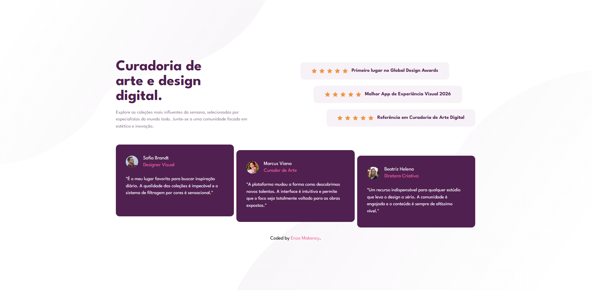

# 🌟 Curadoria de Arte - Social Proof Section

## 📖 Sobre o Projeto

Este projeto foi construído com base no desafio "Social Proof Section" do [Frontend Mentor](https://www.frontendmentor.io), mas com um toque pessoal: o conteúdo foi totalmente adaptado para o português, simulando uma página real de depoimentos para uma plataforma de curadoria de arte digital.

O foco principal do desenvolvimento foi criar uma interface **fluida e altamente responsiva**, garantindo a melhor experiência em qualquer tamanho de tela, além de manter um código limpo, escalável e bem componentizado.

## 🚀 Tecnologias e Ferramentas

- **[React](https://react.dev/)** - Biblioteca JavaScript para construção da interface.
- **[Vite](https://vitejs.dev/)** - Ferramenta de build super rápida para o ambiente de desenvolvimento.
- **[Tailwind CSS (v4)](https://tailwindcss.com/)** - Framework CSS utility-first para estilização ágil.
- **[TypeScript](https://www.typescriptlang.org/)** - Tipagem estática para garantir segurança nos componentes.
- **ESLint** - Para padronização e garantia de qualidade do código.

## 💡 Destaques e Boas Práticas Aplicadas

Durante o desenvolvimento, apliquei diversos conceitos modernos de Front-end:

### 📱 Mobile-First Workflow

A estilização foi pensada primeiro para dispositivos móveis, utilizando o Tailwind para escalar o layout progressivamente para telas maiores através dos prefixos `sm:`, `md:` e `lg:`. Isso garante que o site seja leve e não carregue regras CSS desnecessárias no celular.

### 🧩 Componentização e Reusabilidade (DRY)

A interface foi quebrada em componentes menores e independentes para evitar repetição de código e facilitar a manutenção:

- `<StarCard />`: Componente dinâmico que recebe o texto da avaliação via _props_.
- `<UserReviewCard />`: Componente padronizado para os depoimentos dos usuários, lidando com a injeção de imagens e textos.

### 🎨 Tailwind v4 & Customização de Temas

Utilizei a nova sintaxe do Tailwind CSS (`@theme` no `globals.css`) para injetar o Design System diretamente nas variáveis nativas do framework, incluindo cores primárias (`--color-primary-dark`), tipografia personalizada ("League Spartan") e breakpoints customizados.

### 📐 Domínio de Flexbox e CSS Grid

- **CSS Grid:** Utilizado para criar a estrutura macro do Desktop, dividindo perfeitamente a área de títulos da área das avaliações globais.
- **Flexbox Avançado:** Utilizado para alinhar os componentes internos. O maior destaque vai para o efeito "escadinha" (staggered layout) dos cards, alcançado manipulando o eixo transversal do Flexbox (`flex-col`) combinado com propriedades de alinhamento independente (`self-start`, `self-center`, `self-end`).

### 🖼️ Posicionamento Absoluto de Backgrounds

Resolução de um layout complexo de fundo onde múltiplas imagens SVG com tamanhos relativos precisavam coexistir responsivamente. A solução envolveu criar contêineres absolutos com índices-Z negativos (`-z-10`) e controle preciso de `background-size` com classes arbitrárias do Tailwind (`bg-size-[100%_auto]`).

## 👨‍💻 Autor

Desenvolvido com dedicação por **Enzo Makenzy**.

- GitHub: [@enzomakenzy](https://github.com/enzomakenzy)
